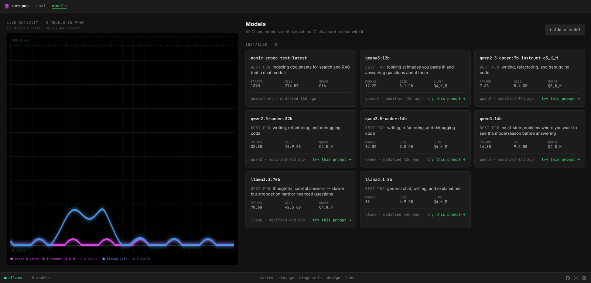

# 🐙 octopus

Local Ollama model lab — chat alongside live telemetry (tokens/sec, TTFT, GPU/VRAM, loaded models).



Chat page layout:

```
┌──────────────────────────────┬──────────────────┐
│ chat (streaming)             │ last response    │
│                              │ • tokens/sec     │
│                              │ • TTFT           │
│                              │                  │
│                              │ loaded in vram   │
│                              │ gpu (vram, util) │
└──────────────────────────────┴──────────────────┘
```

## Stack

- **Backend**: FastAPI on `:8800`, streams Ollama (`127.0.0.1:11434`)
- **Frontend**: Svelte 5 + Vite + Tailwind 4 on `:8801`
- **Pages**: Chat, Models, System, Design, Settings
- **Theme**: light (cream/ink-black) and dark (black/phosphor-green), persisted to localStorage

## Run

```bash
./start.sh        # starts backend (8800) + frontend (8801)
```

Open <http://localhost:8801>.

## Development

The repo has linting, type-checking, formatting, tests, and pre-commit hooks. Don't bypass them; fix the underlying issue.

### One-time setup

```bash
# Backend
cd backend
python3 -m venv .venv
.venv/bin/pip install -r requirements-dev.txt

# Frontend
cd ../frontend
npm install

# Repo-root husky
cd ..
npm install
```

### Day-to-day

```bash
npm run validate       # everything: lint + types + tests + format + patterns
npm run fix            # autofix what can be autofixed
```

Per-stack:

| | command |
|---|---|
| Frontend lint (ESLint) | `cd frontend && npm run lint` |
| Frontend CSS lint | `cd frontend && npm run lint:css` |
| Frontend type-check | `cd frontend && npm run check` |
| Frontend format check | `cd frontend && npm run format:check` |
| Frontend tests | `cd frontend && npm test` |
| Backend lint + format | `cd backend && ./.venv/bin/ruff check . && ./.venv/bin/ruff format --check .` |
| Backend types | `cd backend && ./.venv/bin/mypy .` |
| Backend tests + coverage | `cd backend && ./.venv/bin/pytest --cov=. --cov-report=term-missing` |

Coverage gate: backend must stay above **70%** (currently 95%).

## Governance — no wack-a-mole coding

Rules enforced by tooling, not memory:

1. **Single source of truth for colors.** Hex values are declared only in `frontend/src/app.css`. Components use semantic Tailwind utilities (`bg-surface`, `text-heading`) or `var(--accent)`. Banned: `bg-[#xxx]`, inline hex in `style=` attrs.
2. **Sanctioned UI primitives.** New buttons/cards/badges use `frontend/src/lib/components/ui/`. If you need something the primitives don't provide, add it there first.
3. **Pre-commit hook** runs ESLint, Prettier, Stylelint, ruff, and `validate-patterns.sh` on every commit.
4. **CI** (`.github/workflows/ci.yml`) re-runs everything on every push/PR. Coverage must not drop below the gate.
5. **The `Design` tab in the running app** is a living style guide showing every token and primitive in both themes.

If you find yourself writing CSS or markup that doesn't fit the primitives, **stop and add a primitive** — don't paste-shape the existing one.

## Layout

```
octopus/
├── backend/                   # FastAPI
│   ├── main.py
│   ├── test_main.py
│   ├── pyproject.toml         # ruff, mypy, pytest, coverage configs
│   └── requirements-dev.txt
├── frontend/                  # Svelte 5 + Vite + Tailwind 4
│   ├── eslint.config.js
│   ├── .stylelintrc.json
│   ├── .prettierrc
│   ├── jsconfig.json
│   ├── vite.config.js
│   ├── vitest.config.js
│   └── src/
│       ├── App.svelte
│       ├── app.css           # design tokens — only place hex lives
│       ├── lib/
│       │   ├── api.js
│       │   ├── components/
│       │   │   ├── Header.svelte
│       │   │   ├── Footer.svelte
│       │   │   ├── OctoLogo.svelte
│       │   │   └── ui/        # design primitives
│       │   ├── pages/         # Chat, Models, System, Design, Settings
│       │   └── stores/        # theme, route
│       └── main.js
├── scripts/
│   └── validate-patterns.sh   # pattern enforcement (called by hook + CI)
├── .github/workflows/ci.yml
├── .husky/pre-commit
├── package.json               # husky + lint-staged orchestration
└── start.sh                   # boots both servers
```

## Ollama on a non-default port

Defaults to `127.0.0.1:11434` (Ollama's standard port). Override with `OLLAMA_URL`:

```bash
OLLAMA_URL=http://127.0.0.1:11435 ./start.sh
```

## License

MIT — see [LICENSE](LICENSE).
